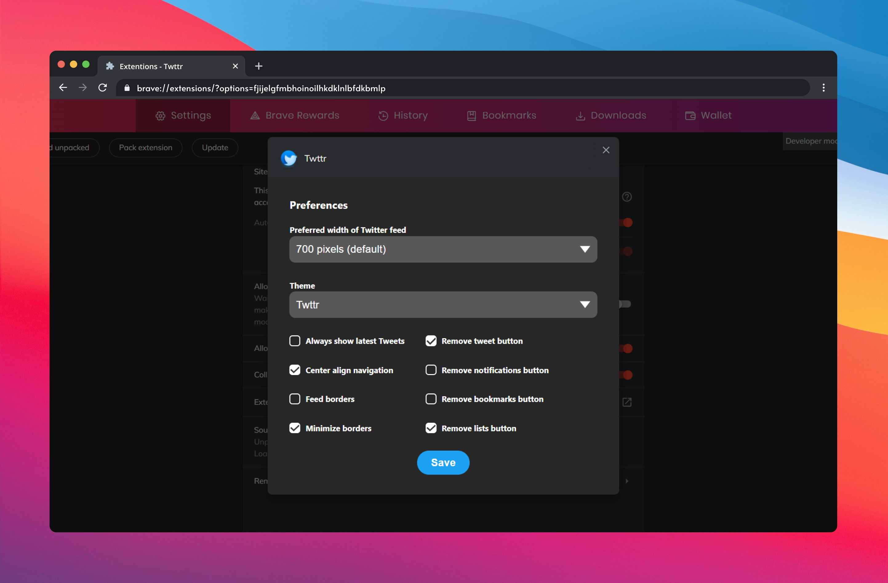

  

<h1 align="center">
  Twttr
</h1>

<h3 align="center">
  Make Twitter Great Again 
</h3>

 

#### **Twttr streamlines your twitter surfing process by prioritizing user-friendly features. [install now](#installation) !**

 - No promoted posts
 - No Topics Selection
 - No trends or "Who to Follow" on Home Page
 - No "Who To Follow" in Timeline/Profiles
 - No border on main feed
 - No message drawer
 - Hidden navigation labels (shown on hover)
 - Navigation pushed to left side of window
 - Search on top right
 - Tweet button on bottom right

#### 🎨 Themes

Currently there are 4 different themes :
1. `Twttr Defalt`
2. `Cozy Twttr` 
3. `Twttr Center`
4. `Cozy Twttr Center`

__Note :__ Cozy themes removes twitter metrics [i.e. number of likes, follows, retweets, etc.] ; )

---

## 📥 Installation

- [Chrome Extension](#chrome)
- ~~Firefox Add-on~~  Soon:tm:

### Chrome
- ~~[Download Chrome extension in the Chrome Web Store]()~~ Soon:tm:  
- [Install Twttr using Developer Mode ](#developer-mode-installation-instructions)  
- [How to set Chrome preferences](#chrome-preferences)  

---

### Developer Mode Installation Instructions

**Google Chrome / Microsoft Edge** [(or any Chromium-based browser)](https://www.zdnet.com/pictures/all-the-chromium-based-browsers/)

**1.** Download this repo as a [ZIP file from GitHub](https://github.com/sreechar/twttr/archive/refs/heads/main.zip).  
**2.** Unzip the file and you should have a folder named `twttr-master`.  
**3.** In Chrome/Edge go to the extensions page (`chrome://extensions` or `edge://extensions`). 
**4.** Enable Developer Mode.  
**5.** Drag the `twttr-master` folder anywhere on the page to import it (do not delete the folder afterwards).

---

## ⚙️ Preferences

Customization currently available in Chrome! 

### Chrome Preferences

**1.** Right click or secondary click on the Minimal Twitter Extension and select `Options`  
**2.** Set user preferences  
**3.** Click `Save` button  

## Screenshot

## :pen: Contributions

Feel free to make an PR along with details of the changes made :thumbsup:

## ⚖️ License

This Project Has Been **[GNU General Public Licensed](./License.md)**
